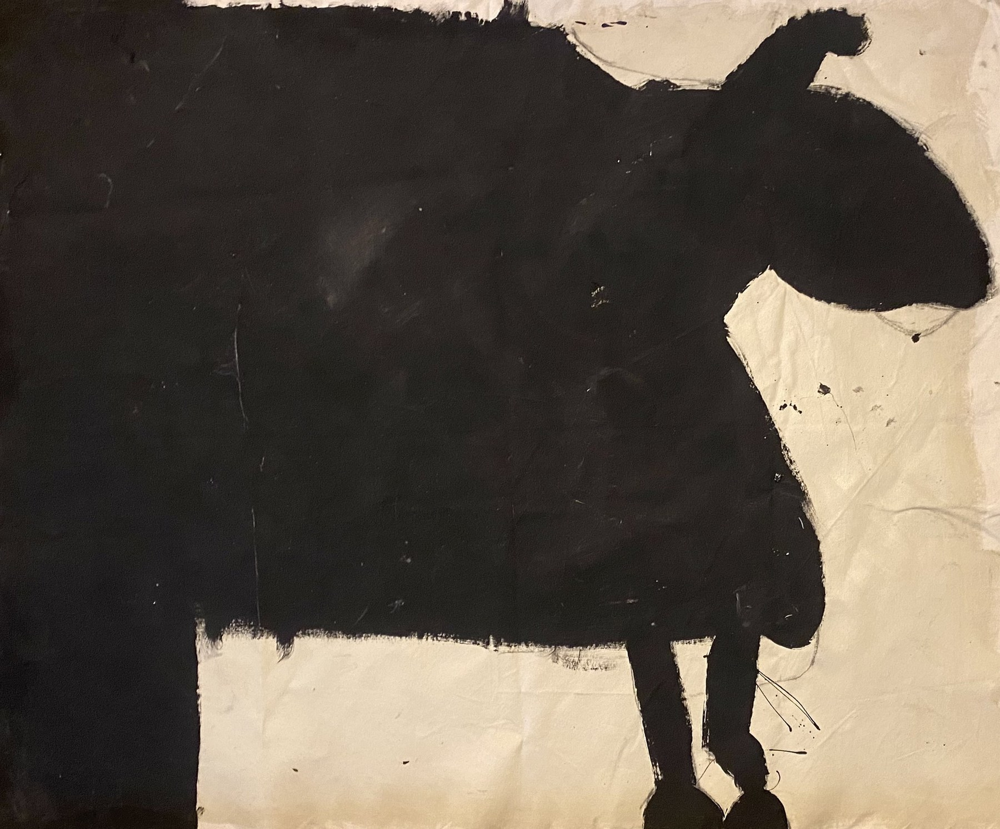

# How to update your site

No tech background needed. Everything is plain text you can edit in a browser.

---

## The one-time setup

1. Make a free GitHub account (or log into the one you have)
2. Make a **public** repository
3. Upload this whole folder
4. Turn on Pages: repo **Settings → Pages**, source = `main` branch, folder = `/ (root)`
5. Point your domain at it

After that, updating is just editing files on github.com in your browser.

---

## Adding a painting

1. Go to your repo on github.com
2. Click the `images` folder → **Add file** → **Upload files**
3. Drag your image in. Name it something simple like `bluepainting.jpg` (no spaces)
4. Click **Commit changes**
5. Go back and click `gallery.html` → click the **pencil icon** to edit
6. Find one of these blocks inside `<div class="gallery-grid">`:

```html
<div class="gallery-item" onclick="openLightbox(this)">
  
</div>
```

7. Copy it, paste it right below, then change one thing:
   - `images/cow.jpg` → `images/bluepainting.jpg`
8. Click **Commit changes**
9. On `index.html`, bump the number next to `gallery` so the count stays right

Your site updates in about a minute.

**Tip:** resize photos to about 1500 pixels wide before uploading. Big files make the site slow.

---

## Adding a song

Your songs are `.wav` files. They are big, so they do **not** go through the
github.com upload button — that button rejects anything over 25MB. Songs have
to go up with git, using the same command list you used the first time.

1. Put the new `.wav` into the `music` folder inside `dechets-site` on your computer.
   Simple name, no spaces — like `slowcollapse.wav`
2. Open `music.html` in Notepad and find this block:

```html
<div class="track">
  <div class="track-title">BREAKS 7_23</div>
  <div class="track-info">2026</div>
  <audio controls preload="none">
    <source src="music/breaks-7-23.wav" type="audio/wav">
  </audio>
  <a href="music/breaks-7-23.wav" download class="track-download">download</a>
</div>
```

3. Copy it, paste it above the others (newest first), change:
   - `BREAKS 7_23` → your song title
   - `2026` → the year
   - **Both** places that say `music/breaks-7-23.wav` → `music/slowcollapse.wav`
4. Bump the `music` count on `index.html`
5. Push it up (see **Pushing changes with git** at the bottom)

Pictures and text can still be edited straight on github.com in your browser.
Only audio needs git.

---

## Adding a note

1. Click `notes.html` → **pencil icon**
2. Find the first `<article class="post">` block
3. Paste this **above** it:

```html
<article class="post">
  <div class="post-date">2026.09.01</div>
  <div class="post-title">your title</div>
  <div class="post-body">
    <p>your first paragraph goes here.</p>
    <p>your second paragraph goes here.</p>
  </div>
</article>
```

4. Change the date, title, and text
5. Click **Commit changes**
6. Bump the `notes` count on `index.html`

The only rule: every paragraph starts with `<p>` and ends with `</p>`.

---

## Changing the background drawing

The drawing behind every page is `images/bg.png`. It is white lines on a
transparent background — that's what keeps it from showing as a grey box on
the black.

- **To swap it:** upload a new file named `bg.png` to the `images` folder.
- **To make it stronger or fainter:** open `style.css`, find `--bg-opacity: 0.16;`
  near the top, and change the number. `0.05` is barely there, `0.35` is loud.
  There's a second, lower value further down inside the mobile section.

---

## Setting up the newsletter

Emails need to land in your inbox at **fisher.jones@dechets.us**.

1. Go to **formspree.io** and sign up (free tier: 50 submissions/month)
2. Create a new form, set the destination email to `fisher.jones@dechets.us`
3. Copy your form ID — a short code like `xrgjkabc`
4. In each of the four HTML files, find `YOUR_FORM_ID` and replace it with that code
5. Commit the changes

There are four spots to change — one on each page. The form will not work
until you do this.

---

## Pointing your domain at the site

Two things have to happen, in either order:

1. **In the repo:** add a file named `CNAME` (all caps, no extension) whose
   only contents are your domain — `dechets.us` — nothing else, no
   `http://`, no trailing slash.
2. **At your registrar's DNS settings:** four A records on the root domain
   pointing at `185.199.108.153`, `185.199.109.153`, `185.199.110.153`,
   `185.199.111.153`, plus a CNAME record for `www` pointing at your
   `username.github.io` address.

DNS changes can take anywhere from ten minutes to a day to take effect.

**Don't cancel Squarespace until the new site is live on the domain and you've
loaded it yourself.**

---

## Things to avoid

- **Spaces in filenames.** Use `my-painting.jpg`, not `my painting.jpg`
- **Deleting the `<` or `>` characters.** If a page looks broken, you probably deleted one by accident. GitHub keeps every old version, so you can always undo.
- **Uploading huge files.** Keep images under about 1MB. Audio can be up to
  100MB per file, but only when pushed with git — github.com's upload button
  caps out at 25MB.
- **Deleting `.nojekyll`.** It's an empty file and it looks pointless. GitHub Pages needs it.

---

## If something breaks

GitHub saves every version. Go to your repo, click **History** (the clock icon), find the last version that worked, and revert to it. Nothing is ever permanently lost.

---

## Pushing changes with git

Only needed when you change audio. For anything else, edit on github.com.

1. Open **PowerShell** (press Start, type `powershell`, hit Enter)
2. Paste these three lines one at a time, pressing Enter after each:

```
cd $HOME\Downloads\dechets-site
git add -A
git commit -m "update" ; git push
```

Your site updates in about a minute.
